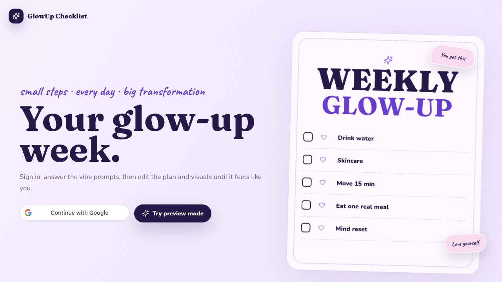

# GlowUp Checklist

[](https://nextjs.org/)
[](https://react.dev/)
[](https://www.typescriptlang.org/)
[](https://vercel.com/)
[](https://neon.tech/)
[](https://www.backblaze.com/cloud-storage)
[](https://ai.google.dev/)
[](LICENSE)

GlowUp Checklist is an AI-backed weekly glow-up planner that turns a short personal setup flow into an editable seven-day checklist, a dynamic theme system, and generated visual artwork. It uses real Google sign-in, real Postgres persistence, real Google AI plan/image generation, and real Backblaze B2 image storage.

## Screenshots



## What It Does

- Signs users in with Google Identity Services and verifies the Google ID token server-side.
- Saves each signed-in user's setup answers, generated plan, generated images, edits, active day, and progress in Postgres.
- Asks a guided setup flow for vibe, identity/persona, artwork direction, schedule, blockers, desired weekly result, and task load.
- Generates a seven-day plan with editable title, subtitle, note, mantra, tasks, task details, task categories, and completion state.
- Generates two image assets per plan: a main poster/avatar image and a soft glassy background image.
- Stores generated images in a private Backblaze B2 bucket through the S3-compatible API.
- Serves private generated images back through a same-origin `/api/media` route.
- Applies AI-selected colors, typography, motifs, icon style, and background imagery to the whole app shell.
- Lets users regenerate the full visuals, poster only, or background only.
- Includes a full image viewer for generated poster/background art.
- Copies a ready-to-post caption with mantra, app link, and hashtags.
- Provides local preview auth for development only; production disables preview auth even if the env var is accidentally set.

## Product Flow

1. User lands on the app and signs in with Google.
2. App verifies the Google credential on the server and creates a signed HTTP-only session cookie.
3. Existing users are hydrated from Postgres and return to their saved setup or workspace state.
4. New users answer the guided setup questions.
5. `/api/plan` calls Google AI and requires a strict JSON weekly plan with theme data.
6. `/api/image` calls Google AI image generation for poster/background assets.
7. Generated images are uploaded to Backblaze B2 and stored as same-origin URLs such as `/api/media?key=generated%2Fbackground%2F2026-05-18%2F064a4d46-e491-4d9f-96d3-3e3c8e291091.png`.
8. User edits tasks, text, visuals, and progress; signed-in state syncs back to Postgres.

## Tech Stack

| Layer | Choice |
| --- | --- |
| Framework | Next.js 16 App Router |
| UI | React 19, TypeScript, CSS custom properties |
| Icons | `lucide-react` |
| Fonts | Vendored Google font packages via `@fontsource`, not build-time remote font fetches |
| Auth | Google Identity Services, `google-auth-library`, signed JWT session cookie via `jose` |
| AI text | Google AI `generateContent` |
| AI images | Google AI image generation |
| Database | Neon Postgres through `@neondatabase/serverless` |
| Image storage | Backblaze B2 S3-compatible API through `@aws-sdk/client-s3` |
| Hosting | Vercel |

## App Routes

| Route | Purpose |
| --- | --- |
| `/` | Main app shell |
| `/api/config` | Public runtime config for Google button + local preview availability |
| `/api/auth/google` | Google ID token verification and session creation |
| `/api/auth/me` | Current session profile lookup |
| `/api/auth/logout` | Session cookie clear |
| `/api/auth/preview` | Local-only preview session; returns `403` in production |
| `/api/state` | Load/save/delete signed-in user state |
| `/api/plan` | AI weekly plan generation |
| `/api/image` | AI poster/background generation and B2 upload |
| `/api/media` | Same-origin private generated image reader |
| `/manifest.webmanifest` | PWA manifest |
| `/robots.txt` | Search crawler policy |
| `/sitemap.xml` | Canonical sitemap |

## Data Model

The app creates two tables:

```sql
create table if not exists glow_users (
  id text primary key,
  email text not null,
  name text not null,
  picture text,
  created_at timestamptz not null default now(),
  updated_at timestamptz not null default now()
);

create table if not exists glow_states (
  user_id text primary key references glow_users(id) on delete cascade,
  state jsonb not null,
  created_at timestamptz not null default now(),
  updated_at timestamptz not null default now()
);
```

`glow_states.state` stores the user's current app state as JSON: answers, setup step, plan, generated image URLs, active day, edits, and completion state.

## Image Storage

Generated images are written to Backblaze B2 with keys like:

```text
generated/poster/2026-05-18/{uuid}.png
generated/background/2026-05-18/{uuid}.png
```

Current non-secret production storage settings:

| Setting | Value |
| --- | --- |
| Bucket | `glowup-web-img-store` |
| Endpoint | `https://s3.us-east-005.backblazeb2.com` |
| Region | `us-east-005` |
| Access | Private bucket, app streams reads through `/api/media` |

There is no silent base64 or fake image fallback in production. If AI generation or B2 storage fails, the API returns an error and the UI shows the error.

## Environment Variables

Use `.env.local` for local development and Vercel project environment variables for deployed environments. Secret values are intentionally not committed.

| Variable | Required | Runtime | Notes |
| --- | --- | --- | --- |
| `NEXT_PUBLIC_GOOGLE_CLIENT_ID` | Yes | Browser | Google OAuth web client ID used by Google Identity Services. |
| `GOOGLE_CLIENT_ID` | Yes | Server | Same Google OAuth web client ID, used to verify ID tokens. |
| `AUTH_SECRET` | Yes | Server | At least 32 characters. Required in production. |
| `PREVIEW_AUTH_ENABLED` | Local only | Server | Set `true` only for local smoke testing. Production ignores it and disables preview auth. |
| `GEMINI_API_KEY` | Yes | Server | Google AI API key. |
| `GEMINI_TEXT_MODEL` | Yes | Server | Current default: `gemini-3-flash-preview`. |
| `GEMINI_IMAGE_MODEL` | Yes | Server | Current default: `gemini-2.5-flash-image`. |
| `DATABASE_URL` | Yes | Server | Neon/Postgres connection string. |
| `POSTGRES_URL` | Alternative | Server | Accepted when Vercel injects this name. |
| `B2_BUCKET` | Yes | Server | Current bucket: `glowup-web-img-store`. |
| `B2_ENDPOINT` | Yes | Server | Current endpoint: `https://s3.us-east-005.backblazeb2.com`. |
| `B2_REGION` | Yes | Server | Current region: `us-east-005`. |
| `B2_KEY_ID` | Yes | Server | Backblaze application key ID. Keep secret. |
| `B2_APPLICATION_KEY` | Yes | Server | Backblaze application key. Keep secret. |
| `B2_PUBLIC_BASE_URL` | Optional | Server | Leave unset for private bucket reads through `/api/media`; set only for a Friendly URL/CDN origin. |

## Local Development

```bash
npm install
cp .env.example .env.local
```

Fill `.env.local` with the real local/dev credentials. Then initialize the database schema:

```bash
npm run db:init
```

Start the app:

```bash
npm run dev
```

Open:

```text
http://localhost:3000
```

For local preview mode only:

```env
PREVIEW_AUTH_ENABLED=true
```

## Google Setup

Create a Google OAuth web client and configure these JavaScript origins:

```text
http://localhost
http://localhost:3000
https://glowup.chamudi.xyz
```

Set the same web client ID in both:

```env
NEXT_PUBLIC_GOOGLE_CLIENT_ID=
GOOGLE_CLIENT_ID=
```

The server verifies the credential using `google-auth-library`; the client ID must match the token audience.

## Google AI Setup

Create a Google AI API key and set:

```env
GEMINI_API_KEY=
GEMINI_TEXT_MODEL=gemini-3-flash-preview
GEMINI_IMAGE_MODEL=gemini-2.5-flash-image
```

The model names are env-configurable because preview model availability changes. The app does not pretend generation succeeded when provider calls fail.

## Backblaze B2 Setup

Use a private B2 bucket with S3 compatibility enabled.

Required key permissions:

- Read files
- Write files
- Delete files
- List bucket names when using a bucket-restricted key with the AWS SDK

Production values currently used:

```env
B2_BUCKET=glowup-web-img-store
B2_ENDPOINT=https://s3.us-east-005.backblazeb2.com
B2_REGION=us-east-005
B2_KEY_ID=
B2_APPLICATION_KEY=
B2_PUBLIC_BASE_URL=
```

Leave `B2_PUBLIC_BASE_URL` empty to keep the bucket private and serve generated images through `/api/media`.

## Vercel Deployment

The app is designed for Vercel production deployment.

1. Create or link the Vercel project.
2. Set all required env vars for Production, Preview, and Development.
3. Run the database initializer against the production database once.
4. Deploy:

```bash
npm exec --yes vercel@54.1.0 -- deploy --prod --yes
```

The current production domain is:

```text
https://glowup.chamudi.xyz
```

## Scripts

| Script | Purpose |
| --- | --- |
| `npm run dev` | Start local Next.js development server |
| `npm run build` | Build the production app |
| `npm run start` | Run the production server locally after build |
| `npm run lint` | Run ESLint |
| `npm run typecheck` | Generate typed routes and run TypeScript |
| `npm run check` | Run lint, typecheck, and production build |
| `npm run db:init` | Create `glow_users` and `glow_states` in Postgres |

## Verification Checklist

Before considering a release ready:

```bash
npm run check
```

Then verify the live deployment:

```bash
curl -i https://glowup.chamudi.xyz/api/config
curl -i https://glowup.chamudi.xyz/api/auth/me
curl -i -X POST https://glowup.chamudi.xyz/api/auth/preview
curl -I https://glowup.chamudi.xyz/
curl -I https://glowup.chamudi.xyz/favicon.ico
curl -I https://glowup.chamudi.xyz/manifest.webmanifest
curl -I https://glowup.chamudi.xyz/opengraph-image.jpg
```

Expected production behavior:

- `/api/config` returns `previewAuthEnabled:false`.
- `/api/auth/me` returns `{"profile":null}` for an anonymous visitor.
- `/api/auth/preview` returns `403`.
- App metadata assets return `200`.
- AI plan generation returns `source:"ai"`.
- AI image generation returns `source:"ai"` and `storage:"backblaze-b2"`.
- Returned URLs such as `/api/media?key=generated%2Fbackground%2F2026-05-18%2F064a4d46-e491-4d9f-96d3-3e3c8e291091.png` stream real image bytes.

## Production Safety Notes

- `AUTH_SECRET` is mandatory in production and must be at least 32 characters.
- Preview auth is blocked in production at the route level.
- Generated images are not faked when provider/storage fails.
- API responses that reflect auth/config/state use no-store headers.
- Google sign-in state is session-backed and persisted per Google user in Postgres.
- Existing user progress should return after refresh and after signing in again.
- The bucket can stay private; the app reads generated media server-side.

## SEO and App Metadata

The app includes:

- `app/favicon.ico`
- `app/icon.png`
- `app/apple-icon.png`
- `app/opengraph-image.jpg`
- `app/twitter-image.jpg`
- `app/manifest.ts`
- `app/robots.ts`
- `app/sitemap.ts`
- Metadata in `app/layout.tsx` with canonical production URL

## Repo Structure

```text
app/
  api/
    auth/
    config/
    image/
    media/
    plan/
    state/
  layout.tsx
  page.tsx
  globals.css
components/
  glow-up-app.tsx
lib/
  db.ts
  fallback.ts
  http.ts
  image-storage.ts
  session.ts
  theme.ts
  types.ts
scripts/
  init-db.mjs
docs/
  screenshots/
```

## Design Notes

- The UI uses a light glassmorphism system with real generated background art behind translucent panels.
- Theme colors, display font, body font, handwriting font, motifs, and icon style come from the AI plan response.
- Buttons and task cards are designed to wrap instead of overflow.
- Tasks stay clean and action-focused: label, optional detail, category icon, and completion state.
- The share action copies a social-ready post, not only the mantra.

## License

GlowUp Checklist is licensed under the **GNU General Public License v3.0 or later**.

See [LICENSE](LICENSE) for the full GPLv3 text. The SPDX identifier for this project is:

```text
GPL-3.0-or-later
```

The license covers the source code in this repository. It does not grant permission to publish, reuse, or expose private credentials, API keys, database URLs, Backblaze application keys, generated user data, or deployment secrets.
